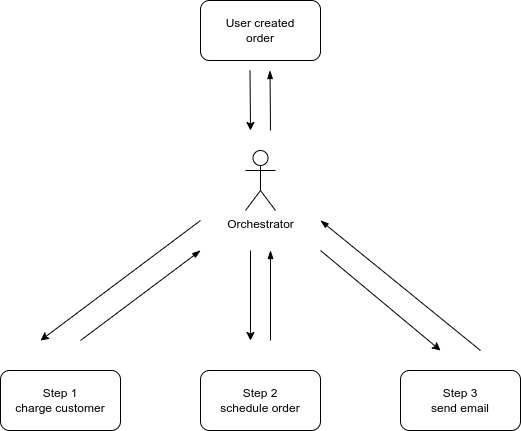

# Choreography vs Orchestration
In microservice communication and code event distribution

<!-- toc -->

- [Intro](#intro)
  * [Example](#example)
    + [Orchestration solution](#orchestration-solution)

<!-- tocstop -->

## Intro

As always there is no silver bullet or one solution that makes everything work perfect every time :)  
So it is important to find the middle ground between two solutions so, in this case, your code can be more flexible, reusable and maintainable :tada: :rocket:.

I'll be honest upfront, I'm leaning towards choreography. As an individuals we are used to giving orders and doing things alone. But if you look at any team, any group that needs to work together to accomplish a goal you will quickly appreciate the art of choreography and the beauty of `!!todo fix!! the complex route done by multiple persons which where all working on there part`.

In every choreography there is also an orchestrator who is not seen when the routine is executed. He is working with team behind the scenes, helping them learn their part and helping them to work together so the result would be complex route envisioned by orchestrator.

Using this analogy and getting back to the coding, we as developers, code writers, are orchestrators and our code is our team that needs to complete some complex route. We should not think of the code as the extension of our selves and trying to imprinting our selves in code as grand orchestrator with maximum control over every part and existence in our code :D.

The main problem, that I see, with orchestrator is the centralisation of responsibility and coupling. Coupling code is really bade for code flexibility, because it makes your code hard to change because in process of changing things lots of coupled code gets broken :shrug:.

### Example
Let's use some example of transactional procedure that needs to be done, and let's say we need to finish procedure in 3 consecutive steps.  
We have purchase system where we buy some item and this are the steps that need to happen in the background:
1. charge customer using provided payment information
2. schedule shipping order for the item to be delivered to customer
3. send confirmation email about shipment with the shipment tracking number

#### Orchestration solution

