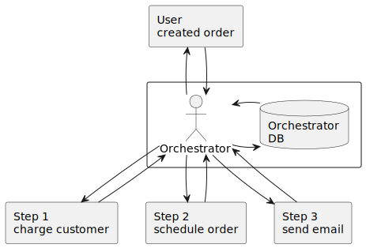
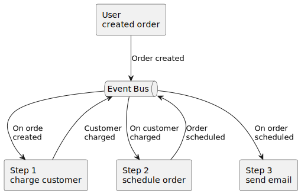

# Choreography vs Orchestration

In microservice communication and code event distribution

<!-- toc -->

- [Intro](#intro)
- [Simplified Example's](#simplified-examples)
  * [Orchestration solution](#orchestration-solution)
  * [Choreography solution](#choreography-solution)
- [Orchestration pros](#orchestration-pros)
  * [Flexibility](#flexibility)
- [Orchestration cons](#orchestration-cons)

<!-- tocstop -->

## Intro

As always there is no silver bullet or one solution that makes everything work perfect every time :smile:  
So it is important to find the middle ground between two solutions so, in this case, your code can be more flexible, reusable and
maintainable :tada: :rocket:.

I'll be honest upfront, I'm leaning towards choreography.
As an individuals we are used to giving orders and doing things alone.
But if you look at any team, any group that needs to work together to accomplish a goal you will quickly appreciate the art of
choreography and the beauty of the complex routine done by multiple persons which where all working on there part.

In every choreography there is also an orchestrator who is not seen when the routine is executed.
He is working with team behind the scenes, helping them learn their part and helping them to work together so the result would be
complex routine envisioned by orchestrator.

Using this analogy and getting back to the coding, we as developers, code writers, are orchestrators and our code is our team that
needs to complete some complex routine.
We should not think of the code as the extension of our selves and trying to imprinting our selves in code as grand orchestrator
with maximum control over every part and existence in our code (anybody said god complex :thinking:).

The main problem, that I see, with orchestrator is the centralisation of responsibility and coupling.
Coupling code is really bade for code flexibility, because it makes your code hard to change because in process of changing things
lots of coupled code gets broken :shrug:.

## Simplified Example's

Let's use some example of transactional procedure that needs to be done, and let's say we need to finish procedure in 3
consecutive steps.
We have purchase system where we buy some item and this are the steps that need to happen in the background:

1. charge customer using provided payment information
2. schedule shipping order for the item to be delivered to customer
3. send confirmation email about shipment with the shipment tracking number

### Orchestration solution

In this solution we can already see that there are to many lines going to and from orchestrator.
This means that orchestrator has a knowledge of all partis included in this transaction.
All the logic for this transaction is centralized in one place, and if anything changes on any participant of the transaction the
change could be required for the orchestrator as well.
Here the complexity of our code rises when we need to store the current phase of the transaction into database after each step.
If we where storing this information in memory we would risk the possibility of losing information which could occur if there is
unexpected error or server is shutdown for some reason.

### Choreography solution

In this solution we see that no entity is talking directly to other entity.
This is decentralised process, in other words no one knows that any other process exists.
Each process only knows what it needs to do, when or what is the trigger for that process and what is the result and it's
responsibility is to broadcast the information after the process is finished.
This is highly flexible but if overused we can create spaghetti message queue hell 

## Orchestration pros

### Flexibility

Tha main positive aspect is flexibility, in my opinion this is one of the most important characteristics of software (the magic
thing making it soft :smile: ).

## Orchestration cons
