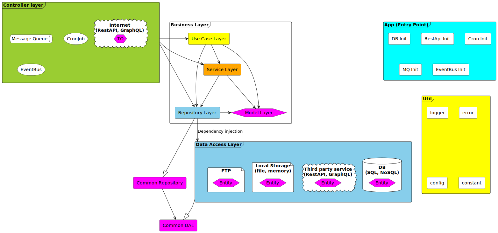

# Programming architecture

<!-- toc -->

- [App Layer (AL)](#app-layer-al)
- [Controller Layer (CL)](#controller-layer-cl)
- [Business Layer (BL)](#business-layer-bl)
  * [Service Layer (SL)](#service-layer-sl)
  * [Use Case Layer (UCL)](#use-case-layer-ucl)
  * [Repository Layer (RL)](#repository-layer-rl)
  * [Data Access Layer (DAL)](#data-access-layer-dal)
  * [Model Layer (ML)](#model-layer-ml)
- [Library Layer (LL)](#library-layer-ll)
- [Util Layer (UL)](#util-layer-ul)
- [Folder structure example for node.js application](#folder-structure-example-for-nodejs-application)

<!-- tocstop -->



## App Layer (AL)

Sometime when the application is starting we need to do some initial setup before our application is available to the world.
Also when the application needs to turn off we sometimes also have a need to do some cleanup or even hide the application from the
world and wait until all current processes are finished before turning off the application.
Here we need to have ability to run processes asynchronously and to run them sequentially or in parallel.

We can use this layer to define different ways we want to start our application. If we want to run unit tests on our application
we can decide not to start RestAPI interface and we don't need to create a connection to database.

For example if we are writing our backend application in node.js:  
When running the application first we want to make a connection to the database and run migrations (if needed) on the database.
In the same time we can register EventBus(rxjs) because we are certain that no other request can come through our controller.
In the second step of the initialization we can think about starting some interfaces that are going to open our application to the
world. We could in parallel lunch RestAPI, MessageQueue and CronJob.

In this example it was important for our application that in first step of the initialization we have connected to our database
and finished any migrations necessary for our application to function properly. This is important because after we start listeners
in our controller layer our application is fully live and needs to be setup correctly.

When we are ready to turn off our application (because we are releasing new version).
Force killing the application is never a good idea because off potential lose of information (killing unfinished processes).
Depending where are we running our application (AWS, Azure, Google...) some environments have their own mechanism of redirecting
traffic to new instances, but it is not a silver bullet. This mechanisms may not include all of our incoming signals (message
queue, cron job).

The best way to safely turn off our application is to turn off all the listeners and let all process to finish and our
application is going to turn off on it's own (this is true for node.js application).

Potential problem that we can have is when we turn off the database connection we need to be sure that there are no other
processes running.

If any error occurred during application shutdown it would be wise to log such error.

## Controller Layer (CL)

This is a place where we want to keep all entry point of our application, in the other words, if anyone is invoking any action in
our application it need to happen in controller layer first.
This is going to make it a lot easier to track any process (if we know where it could have started).
This is also a good place to make border for any transport framework we are using so it would not spill into our business logic.

Entry point for our application can be: RestAPI, GraphQL, MessageQueue, CronJob, EventBus...
In this layer we need to define router in which the messages/invocations are routed to desired functionality. This routes need to
be readable, and if possible, defined in one place (so we don't overlook some routes).
Every route has a handler.
This handler must not have any business logic, in other words, it can only execute one function from the business logic.
This is important because two or more different transports can trigger same functionality, and if we had some logic in controller
we would need to duplicate that code for each transport controller.
For example the same trigger could come from RestAPI and from MessageQueue.

Controller handler need to handle data that is coming from the end user. This is a place where we need to do validation and
if needed transformation of data. It is important that validation and transformation is done in handlers because every controller
is going to have it's own data structure regarding it's transport system (RestAPI, MQ...)

## Business Layer (BL)

Business layer is responsible for our business logic. This layer should stay clear of the frameworks so our business logic would
not depend on it.
This layer can be complex so we need to brake it down

- Use Case Layer (UCL)
- Service Layer (SL)
- Repository Layer (RL)
- Data Access Layer (DAL)
- Model Layer (ML)

### Service Layer (SL)

In this layer we write code that we as developers see to be reusable and it has business value.
We need to make sure that this logic is simple and does only one thing (low complexity).
Naming convention is really important here, so name of the function needs to explain exactly what is the purpose of the function.
If the name is to long probably our function is to complex.

### Use Case Layer (UCL)

Because it is impossible to write an application by using only short function names (and function which are not complex) we have
a need to introduce a new layer where this rule is going to be ignored.
This is Use Case Layer, as the name implies, we are going to use it to store any functionality that we get from our product owner,
actually this is business logic that can be changed by any moment, dictated by market.
The main difference between SL and UCL is that UCL is changed by changes in market and SL is changed whit technical requirements.
UCL should not have code that resembles something that should be in SL, it should call/orchestrate functions from SL.
Ideally when we open a function from UCL we should be abel to understand it's functionality by reading names of the SL functions
called in it (reading them like a book).
Name of the UCL function can be short, but it should accompanied with the documentation/requirement for that feature, which when
reading we should be seeing same functionality in the UCL body of the function.

### Repository Layer (RL)

In RL we place business logic which is responsible for storing and loading data. When we think of storing data it not important
which method we use for storing it is only important that we can store it for long time and recall it when needed.
We can use DB, file, memory, ftp, third party system, RestApi, GraphQL...

This is also a good place to create a border and keep frameworks away from our business logic.
To do this we need to create an data access layer - DAL.
This is going to give us flexibility, if needed, to switch data type of any entity by switching data access layer.

This layer is used as adapter for any type of data that we need to store it is good idea to make a standard/common way of
manipulation of the data.
This way we get a standardised way of filtering and sorting our data.

### Data Access Layer (DAL)

This layer is managing how we are actually storing or fetching data.
We can store data in DB, file, memory, ftp, third party system, RestApi, GraphQL...

This layer should actually be a wrapper for the framework that we are using to manipulate data. This framework should never spill
into RL.

### Model Layer (ML)

Model is the most important part of our application.
Model defines and shapes our whole application.
If anything changes in the ML we every other layer may need to be changed, because every other layer depends on ML.

In the beginning of the application, until the application is not complex, we don't need to make differences between Entity, Model
and TransportObject.
But we have to be aware that we have this tools and that we can use them at any moment, and that we shouldn't corrupt our model
without checking if the solution is made by changing Entity or TransportObject.

- Entity: Object definition for DAIL, used to represent the data of the storage
- TransportObject: Object definition for CL, used if we need to redefine what is send to end user without changing Model

In our diagram we have Entities defined i DAIL. If we have a need to store some model in database, we don't need to store all
properties of the model, maybe we have some calculated fields.
For example, if we have a model with `firstName`, `lastName` and `fullName`, we don't need to store the `fullNeme` in the database
because we can always calculate it by concatenating `firstName` and `lastName`.

For the TransportObject, this is a object definition that is a response to the request made through CL. We can have a requirement
to differently format data or hide some data before sending it to the end client.

## Library Layer (LL)

This layer is used for wrapping code that potentially can be used in other applications so it is easily extractable.
We need to threat it as third party library so we can easily extract it and reuse it in other applications.
It should be convenient for us to write code and not to over-engineer, start creating a new external library just because
something can be used elsewhere, or embed some part of the code in our business logic which can be use elsewhere.
We need to find the middle ground.

## Util Layer (UL)

This layer is used for storing functionalities which have no business logic in them.
This functions can be used across all layers with no restrictions.
God example for Util Layer are logger, env, error.

## Folder structure example for node.js application

```
src
├── app
│   └── init
├── business
│   ├── model
│   ├── repo
│   ├── service
│   └── use-case
├── controller
│   └── express
├── dal
│   └── typeorm
│       └── entity
├── lib
│   └── typeorm
│       ├── migration
│       └── subscriber
└── util

```
