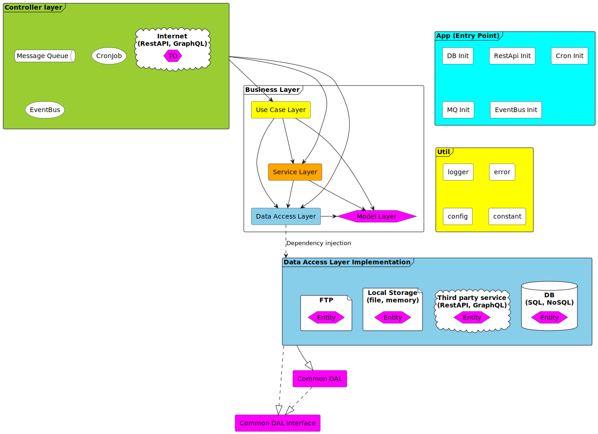

# Programska Arhitektura

<!-- toc -->

- [App Layer (AL)](#app-layer-al)
- [Controller Layer (CL)](#controller-layer-cl)
- [Business Layer (BL)](#business-layer-bl)
  * [Service Layer (SL)](#service-layer-sl)
  * [Use Case Layer (UCL)](#use-case-layer-ucl)
  * [Data Access Layer (DAL)](#data-access-layer-dal)
  * [Data Access Implementation Layer (DAIL)](#data-access-implementation-layer-dail)
  * [Model Layer (ML)](#model-layer-ml)
- [Library Layer (LL)](#library-layer-ll)
- [Util Layer (UL)](#util-layer-ul)

<!-- tocstop -->

## App Layer (AL)

[//]: # (> Summary : App layer je deo aplikacije koji se prvi izvršava i koristi se za inicijali setup. Može se koristiti za registrovanje rest endpointa i za otvaranje konekcija ka bazi ili drugim servisima kao i orkestraciji init procesa i redosleda izvršavanja. Isto se koristi i za bezbedno gašenje aplikacije.)

Prilikom pokretanja aplikacije nekad postoji potreba da se izvrši podešavanje aplikacije pre nego što može da se kaže da
je aplikacija spremna za rad. U ovom delu aplikacije moramo da imamo mogućnost kako da izvršimo određene akcije
sekvencijalno ili paralelno. U ovom delu možemo čak definisati različite načine kako se pokreće aplikacija (npr. ako
pokrećemo aplikaciju da bi je testirali možemo da odlučimo da ne pokrećemo RestAPI interfejs)

Primer pokretanja backend aplikacije pisane u node.js-u. Prilikom prvog pokretanja želimo da ostvarimo konekciju ka bazi
i izvršimo migraciju ako je potrebno. Ovo se dešava u prvom koraku inicijalizacije. Paralelno sa ovom akcijom možemo da
registrujemo eventBus pošto smo sigurni da još uvek nijedan signal neće stići do Controller-a pošto nismo registrovali
ništa drugo. U drugom koraku inicijalizacije već možemo da razmišljamo o registrovanju nekih mehanizama koji će našu
aplikaciju otvoriti ka korisnicima. U ovom drugom koraku možemo da paralelizujemo registraciju RestAPI endpointa,
MessageQueue-a i pokrenemo CronJob.

U ovom primeru nam je bilo bitno da pri prvom pokretanju aplikacije da podignemo bazu izvršimo potrebnu migraciju i
budemo sigurni da čim stigne prvi klijentski zahtev da je naša aplikacija spremna.

U App sekciji takođe moramo da imamo mogućnost da bezbedno ugasimo aplikaciju. Ako želimo da ugasimo aplikaciju, npr.
zbog podizanja nove verzije, potrebno je u nekom trenutku ugasiti staru verziju. Nasilno gašenje nikada nije dobro,
pošto možemo da izgubimo podatke. Neki sistemi imaju mehanizam za preusmeravanje http requestova tako da nivou
infrasturkture ne dozvoljavamo requestovima da stižu do naše stare aplikacije. Ovakav mehanizam ne obuhvata sve ulazne
delove naše aplikacije. Ako naša aplikacija koristi, pored RestAPI-a, CronJob ili MessageQueue, mi moramo da budemo
sigurni da nismo uzeli nijednu poruku da obrađujemo pre nego što ugasimo aplikaciju.

Najbolji način za ovo je da jednostavno ugasimo listenere, subscribere i pustimo da se kod sam ugasi kad završi sve
svoje obaveze (ova objašnjenje najviše važi za node.js zbog načina njegovog rada)

Tako da prilikom gašenja, kada stigne SIGERM signal, potrebno je da ugasimo sve listenere koje smo registrovali pri
inicijalizaciji i onda da ostavimo neko vreme da se sve lepo ugasi. U slučaju da se sve nije ugasilo onda moramo nasilno
da ugasimo aplikaciju, ali bi bilo dobro da pošaljemo sebi poruku koja nas obaveštava o tome i odvojimo vreme da
otkrijemo gde je zastoj, da nismo možda zaboravili da ugasimo neki listener.

## Controller Layer (CL)

[//]: # (> Summary: Controller layer je mesto gde držimo kod koji može da započne neku akciju u našoj aplikaciji. Možemo da kažemo da je to entry point. Ovaj deo tretiramo kao obod koda &#40;krajnja granica&#41; i ovde je dobro mesto da držimo frameworke na distanci, daleko od naše biznis logike.)

Kontroler je mesto čiji je cilj da grupiše na jednom mestu entryPoint naše aplikacije za krajnje korisnike. Drugim
rečima, šta god da se desi u našoj aplikaciji, moralo je da počne iz kontrolera. Ovo je ujedno dobro mesto da napravimo
granicu za frameworke kako bi istu držali daleko od naše biznis logike.

EntryPointi naše aplikacije mogu biti RestAPI, GraphQL, MessageQueue, CronJob, EventBus... U ovom delu aplikacije je
neophodno definisati ruter, način na koji se rutiraju poruke koje stižu do naše aplikacije. Svaka ruta se obrađuje sa
jednim handlerom. Ovaj handler ne sme u sebi da sadrzi biznis logiku, za njega kažemo da mora da bude tanak (da ima jako
malo linija koda). Neko pravilo je da handler sme da pozove samo jednu funkciju iz servisnog layera. Razlog iza ovog
pravila je da su handlery samo triggeri za našu aplikaciju, i ako nam danas stiže signal za trigerovanje naše aplikacije
preko RestAPI-a, sutra možda budemo imali potrebu da napravimo isti poziv i preko MessageQueue-a, tako da ako smo
stavili kompleksniju logiku u handleru primorani smo da kopiramo kod iz jednog handlera u drugi (dupliranje koda je
velika greška) tacnije bićemo primorani da spustimo logigu u servis (što je trebalo odraditi u startu )

Handleri u kontrolleru trebaju da se bave podacima koji stizu od krajnjeg korisnika, ako je u pitanju RestAPI potrebno
je da izvrše validaciju parametar, body-a, query parametara pre nego što pozovu našu servisnu funkciju i da se takođe
bave spremanju podataka za slanje kao odgovor. Bitno je da validaciju i spremanje podataka za otpremu radimo u handleru
pošto svaki kontroler (RestAPI, MessageQueue...) je zadužen za svoj transportni nivo. Naša biznis logika ne treba da se
bavi radom kontrolera.

## Business Layer (BL)

Business layer se zapravo bavi biznis logikom. Ovaj layer je zapravo najveći i najbitniji, zbog čega imamo potreba da ga
podelimo u pod layere.

Grube podele do kojih sam došao su :

- Use Case Layer (UCL)
- Service Layer (SL)
- Data Access Layer (DAL)
- Data Access Implementation Layer (DAIL)
- Model Layer (ML)

### Service Layer (SL)

U ovom layer-u pišemo logiku koju mi kao programeri vidimo kao celinu i koju možemo da iskoristimo više puta. Naravno
treba se pridržavati pravila da logika bude jednostavnija (zbog lakšeg održavanja) tj. da ta jedna celina (komponenta)
radi jednu stvar, rešava jedan problem i to radi dobro. Nazivi ovih komponenti ili funkcija moraju da verbalizuju tačno
šta se odigrava u njoj. U momentu kada je ovaj naziv predugačak potrebno je proveriti da li naša funkcija radi previše
stvari.

### Use Case Layer (UCL)

Pošto je nemoguće napisati program sa komponentama/funkcijama koje imaju kratke nazive i da ti nazivi opisuju tačno ono
što se odigrava u tim celinama dolazimo do potrebe da uvedemo novi layer gde ovo pravilo neće važiti. Use Case, kako mu
ime kaže, koristićemo za enkapsulaciju funkcija i logike koju dobijamo od prodauct owner-a tj. ovo su biznis zahtevi
koji mogu da se promene u bilo kom trenutku koje diktira tržište. Tako da glavna razlika između SL i UCL je u tome što
UCL se menja u odnosu na tržište a SL se menja u odnosu na tehniče zahteve. I u šustini Use Case ne bi trebalo da ima
neku logiku koja je nalik na SL već više bi pozivala i dirigovala kako se koristi logika iz SL. U idalnom slučaju kada
otvorite jednu funkciju u UCL trebalo bi da možete da procitate kao knjigu (čitajući nazive funkcija koje se pozivaju u
njoj) i da možete da uporedite sa use caseom koji ste dobili od product ownera kao dokumentaciju.

### Data Access Layer (DAL)

DAL je deo biznis logike u kome smeštamo logiku koja definiše kako učitavamo ili čuvamo podatke iz nekog data storage-a.
Kada govorim o storage-u mislim da bilo koji sistem/format gde možemo da sačuvamo podatke koje možemo kasnije da
učitamo, primer za ovo je DB, file, memory, ftp, third party system, RestApi, GraphQL ...

Pošto je ovo mesto gde držimo našu biznis logiku jedna od bitnijih stvari je da držimo kod framewokra na distanci (kako
bi naš kod bio fleksibilniji i ne bi zavisio od frameworka). Da bi smo ovo uradili bezbedno potrebo je da napravimo
implementacioni layer koji će biti mapiran jedan na jedan sa našim DAL-om. Na ovaj način dobijamo fleksibilnost tako što
ako dođe do potrebe da se promeni način kako čuvamo određeni model dovoljno je samo da promenimo implementacioni layer.

Pošto ovaj layer se ponaša kao adapter za sve tipove podataka koje čuvamo/učitavamo, dobra ideja je da napravimo
standard za manipulaciju podataka, tako da naša biznis logika ne zavisi od tipa podatka već da imamo standardizovan
način kako filtriramo, sortiramo podatke. Tako da imamo potrebu da definišemo neki common-dal. Svaki DAIL i Controller
mora da implementira common-dal kod sebe.

### Data Access Implementation Layer (DAIL)

Ovaj layer se bavi podacima koji su smešteni bilo trajno ili privremeno. Podatke možemo sačuvati u bazi, memoriji,
fajlu, ftp-u, na nekom serveru koristeći RestAPI.

Ovaj layer zapravo predstavlja wrapper oko frameworka/načina manipulacijom sa podacima koji mora da implementira
common-dal

### Model Layer (ML)

Model je najbitniji deo naše aplikacije, on zapravo definiše i utiče na izgled naše cele aplikacije. Drugim rečima ako
izmenimo model moraćemo celu aplikaciju da izmenimo pošto svi zavise od ovog layera. U nekoj teoriji ovaj layer bi
trebalo da se menja samo u slučaju da se naša biznis logika menja koja je uslovljena promenom na tržištu.

Dok je aplikacija mala lako možemo da ne primetimo razliku između Entity-a, Model-a i TransportObject-a. Ono što želim
da kažem je da dok je mala aplikacija, dok ta aplikacija ne komunicira sa razlicitim aplikacijama i ne zavisi od drugih
aplikacija OK je da se Model preklapa ili bude identican kao Entity ili TransportObject, ali uvek mora da postoji svest
o njima i lak način da se odvoje po potrebi.

U ovom slučaju Entity je definicja modela u DAIL delu. Ako imamo potrebu da neki Model sačuvamo u bazi, mi ne moramo da
sačuvamo sva polja u bazi, neka možemo da proračunamo u letu, npr. Ako imamo model korisnika koji ima ime prezime i puno
ime, dovoljno je samo sačuvati ime i prezime u bazi a puno ime ćemo dobiti tako što ćemo spojiti ime i prezime u jedno
polje.

A što se tiče TransportObject-a ovo je definicija modela koja se šalje kao odgovor zahtevu koji je stigao preko
Controller-a. Ovde možemo da imamo zahtev da vratimo podatke u odgovarajućem formatu koji ne mora da liči na naš model,
a mi ne bi trebali da zavisimo od externih

## Library Layer (LL)

[//]: # (> <Translated>)
Library layer je mesto gde držimo kod koji potencijalno možemo da iskoristimo u drugim aplikacijama. Dobro je da ga
držimo izdvojeno kako bi mogli kasnije da ga lako izdvojimo u poseban paket. To može biti kod koji je nalik na framework
ili čak wrapper oko frameworka koji možemo smestiti u common paket ili čak opensource paket.

## Util Layer (UL)

Util layer služi za čuvanje funkcija koje nemaju nikakvu biznis logiku I ove funkcije je dozvoljeno pozvati iz bilo kog
layera aplikacije. Dobar primer za ovo je logger, env
